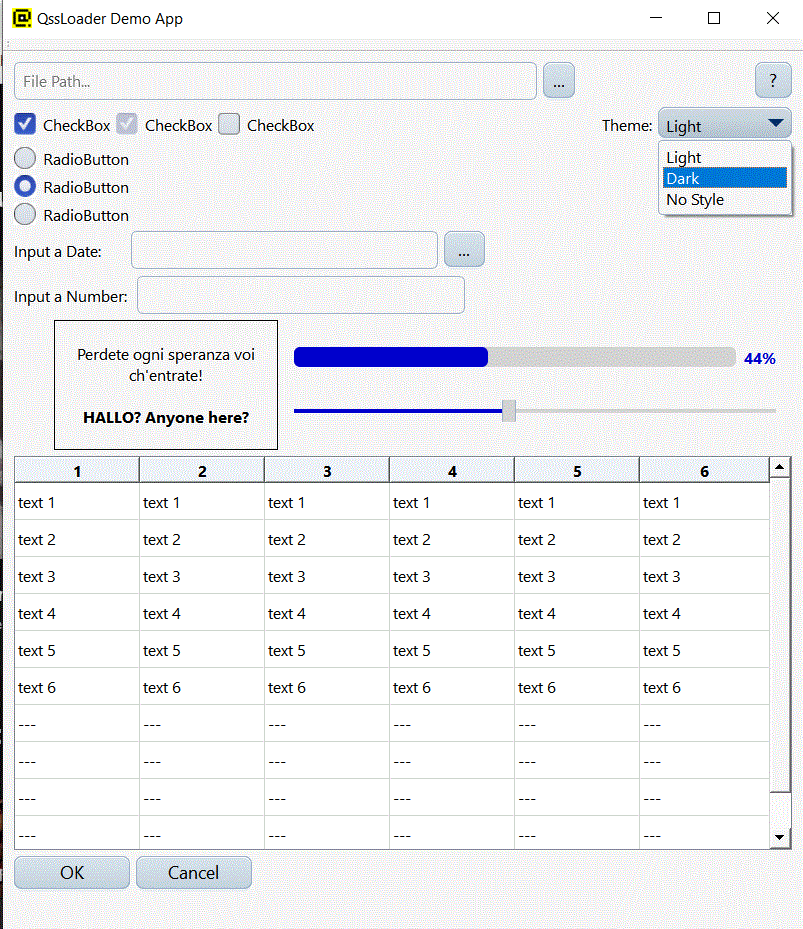
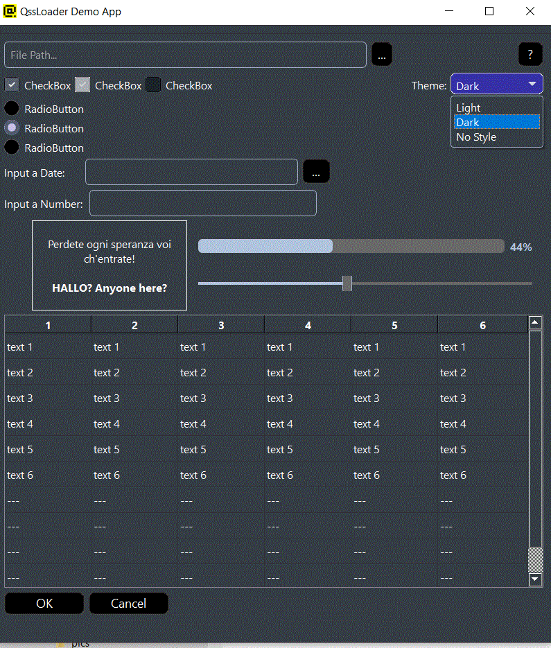
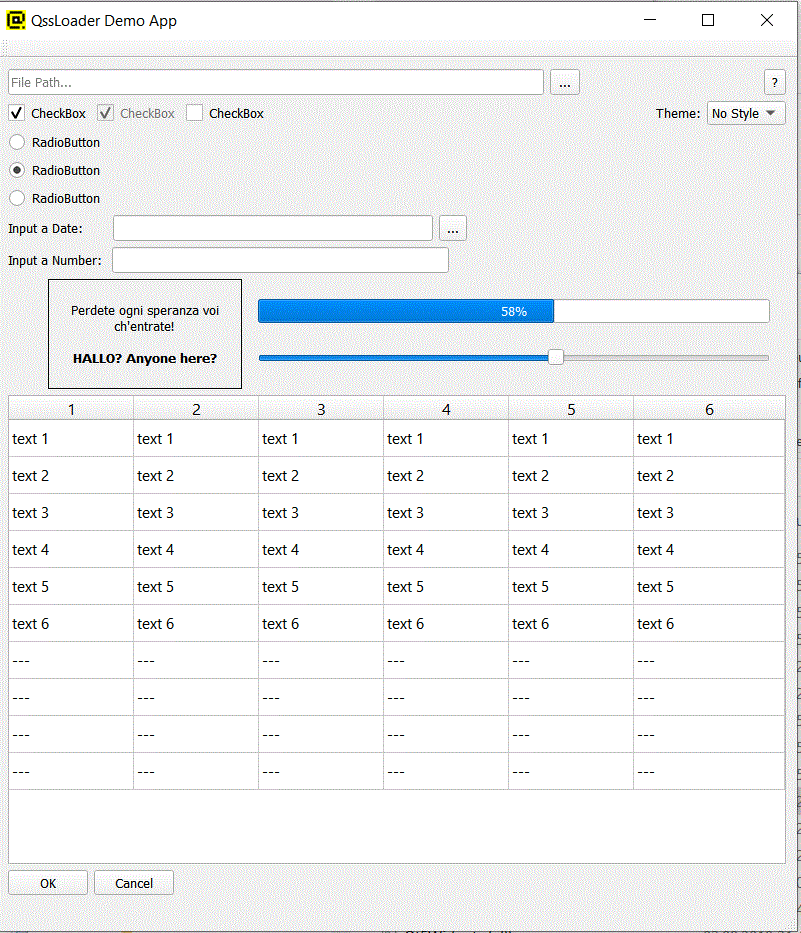

 

# Xamgu QSS style sheets loader for Qt

How many times you wished that you **could define a color once** and wouldn't have to copy & paste it as RGB everywhere in your QSS style sheets? I saw several project implementing that extension again and again...

*Xamgu* is a loader for Qt's QSS style sheet files and file groups boasting some much needed syntactic sugar! Using these extensions you not only can avoid copy and paste but also define variants of your styling like the much needed **Dark/Light** styling themes as demonstrated in the "Demo App" section below!

The supported extensions are:

1. QSS variables 
 you define them like this:

         $default-font-size: 16px;
         $default-font-family: "Arial";
         $default-font-family-for-widgets: $default-font-family;

  and then use them like that:

         QWidget { font-size: $default-font-size; color: red; }

2. QSS file imports:
 you use them like this:

        @import "SomeStylesheetFile.qsse" 

## Usage:

You just load the QSS file containing the extended syntax using the loader class and you will get a processed, valid QSS file as a result:

    // where to look for the stylesheet files?
    QsseFileLoader loader("path-to-your-stylesheet-directory");
   
    // parametrize the files to be loaded
    if (theme == "Light")
    {      
        loader.createVariable("$Theme", "Light");
    }
    else if (theme == "Dark")
    {
        loader.createVariable("$Theme", "Dark");
    }     

    // process files
    QString stylesheet = loader.loadStyleSheet("MyAwsomeStylesheet.qsse");

    // ok?
    if (stylesheet.isEmpty())
    {
        QMessageBox::critical(this, "ERROR", loader.messages().join('\n'));        
    }
    else
    {
        // set the style for the app
        qApp->setStyleSheet(stylesheet);
    }

In case of syntactic errors, you can examine the problem using loader's *messages()* method returning diagnostic and error messages.

## Demo App:

For demo and example purposes a Demo App is also contained in this repository:

## Name

The problem in naming programs is that most good program names are already taken! A good program or project name should have following properties:
- it shouldn't be used elsewhere
- it should be short & pronounceable
- it should have at least something to do with the program

*Xamgu* is [Lojban](https://en.wikipedia.org/wiki/Lojban) for good - as in "a good QSS loader" :).

## TODOs:
 - polish up the dark style icons
 - add support for C++ style comments (???)
 - correct styling of the slider knob in DemoApp (!!!)
 - correct styling of combo box's menu in DemoApp (!!!)
